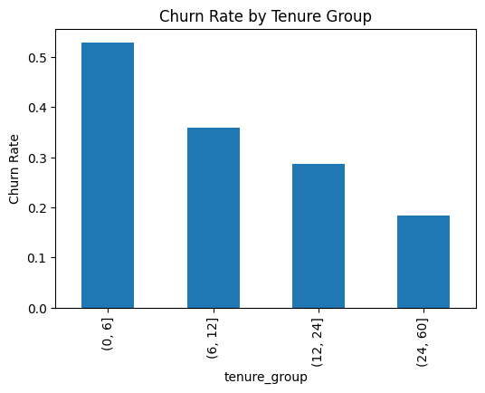
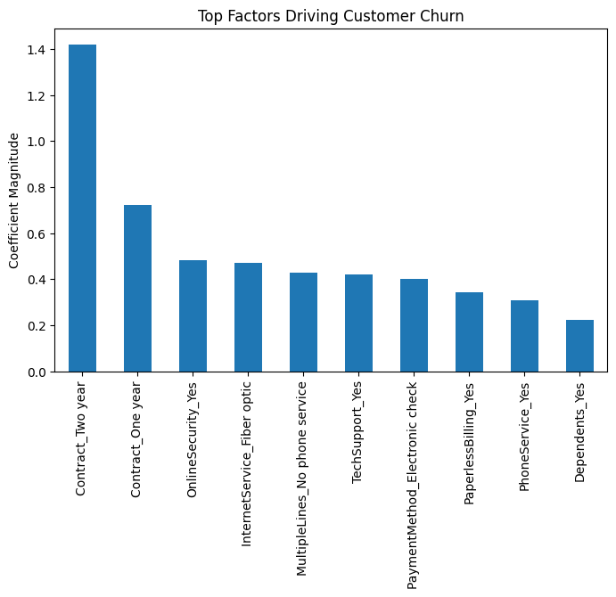
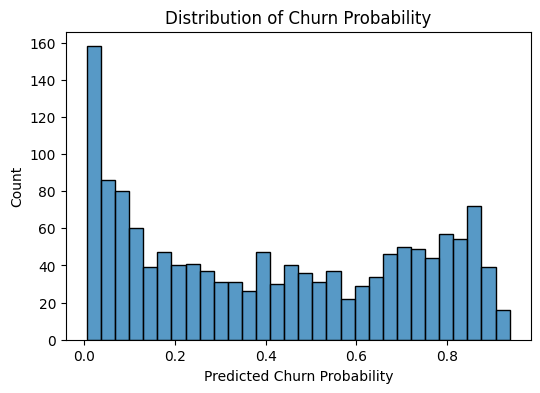

# Customer Churn Analysis and Prediction

## Business Problem

Customer churn is a major challenge for telecom companies. Retaining customers is significantly more cost-effective than acquiring new ones. This project analyzes customer behavior and builds machine learning models to identify customers likely to churn.

---

## Objectives

- Analyze customer churn patterns
- Identify key drivers of churn
- Build machine learning models to predict churn
- Segment customers based on churn risk

---

## Dataset

Telco Customer Churn Dataset

The dataset includes information about:

- Customer demographics
- Contract type
- Internet services
- Monthly charges
- Tenure

Total records: **7043 customers**

---

## Data Preparation

Key preprocessing steps:

- Converted `TotalCharges` to numeric
- Handled missing values
- Feature engineering: **AvgMonthlyCharge**
- One-hot encoding for categorical variables

---

## Exploratory Data Analysis

Key visual insights:

### Churn by Contract Type

Month-to-month customers show significantly higher churn compared to long-term contracts.

---

### Churn by Tenure

Customers with low tenure have a higher likelihood of leaving the service.

---

## Machine Learning Models

Three classification models were evaluated:

| Model | ROC-AUC |
|------|------|
| Logistic Regression | 0.842 |
| Random Forest | 0.830 |
| Gradient Boosting | 0.842 |

Logistic Regression was selected as the final model due to strong performance and interpretability.

---

## Feature Importance

Key factors influencing churn include:

- Contract type
- Monthly charges
- Tenure
- Internet service type

---

## Customer Risk Segmentation

Customers were segmented based on predicted churn probability.

| Risk Level | Probability |
|------|------|
Low Risk | 0 – 0.3 |
Medium Risk | 0.3 – 0.6 |
High Risk | 0.6 – 1 |

---

## Churn Probability Distribution

This distribution shows how the model separates high-risk and low-risk customers.

---

## Business Recommendations

Based on the analysis:

- Encourage customers to switch to long-term contracts
- Provide retention incentives for high-risk customers
- Monitor customers with high monthly charges
- Improve onboarding for new customers

---

## Technologies Used

- Python
- Pandas
- NumPy
- Seaborn
- Matplotlib
- Scikit-learn
- Jupyter Notebook

---

## Project Structure
