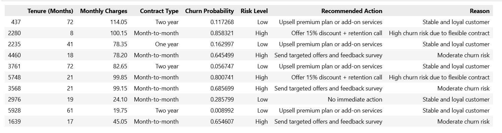

# 🚀 AI-Powered Customer Churn Analysis & Retention System

## 💡 Business Problem

Customer churn is a major challenge for telecom companies. While predicting churn is useful, the real business need is:

👉 What action should be taken to retain customers?

This project goes beyond prediction and builds a **decision system** to recommend actions.

---

## 🎯 Objectives

- Analyze customer churn patterns  
- Build ML model to predict churn  
- Segment customers based on risk  
- Recommend business actions for retention  

---

## ⚙️ System Workflow

Data → ML Model → Churn Prediction → Decision Engine → Action + Reason

---

## 📊 Dataset

Telco Customer Churn Dataset  
Total records: **7043 customers**

Includes:
- Demographics
- Contract type
- Monthly charges
- Tenure

---

## 🔍 Exploratory Data Analysis

### Churn by Contract Type

Month-to-month customers have significantly higher churn.

---

### Churn by Tenure

Low-tenure customers are more likely to churn.

---

## 🤖 Machine Learning Model

| Model | ROC-AUC |
|------|--------|
| Logistic Regression | 0.842 |
| Random Forest | 0.830 |
| Gradient Boosting | 0.842 |

👉 Logistic Regression selected for interpretability.

---

## ⚠️ Customer Risk Segmentation

| Risk Level | Probability |
|------------|------------|
| Low | 0 – 0.3 |
| Medium | 0.3 – 0.6 |
| High | 0.6 – 1 |

---

## 🧠 Decision Engine (Key Highlight)

Instead of only predicting churn, this system recommends actions:

### Example Rules

- High-risk + Month-to-month → Offer discount + retention call  
- Low-risk + Long-term → Upsell premium services  
- New customers → Engagement & onboarding  

---

## 📈 Sample Output

The system provides:

- Churn Probability  
- Risk Level  
- Recommended Action  
- Reason  

---

## 💼 Business Impact

- Identifies high-risk customers  
- Suggests targeted retention strategies  
- Enables data-driven decision-making  

---

## 🛠️ Technologies Used

- Python  
- Pandas  
- NumPy  
- Scikit-learn  
- Matplotlib / Seaborn  

---

## 🚀 Future Scope

- Automate real-time predictions  
- Integrate with dashboards (Power BI / Streamlit)  
- Deploy as decision support system  

---

⭐ If you found this project useful, feel free to star the repository!
